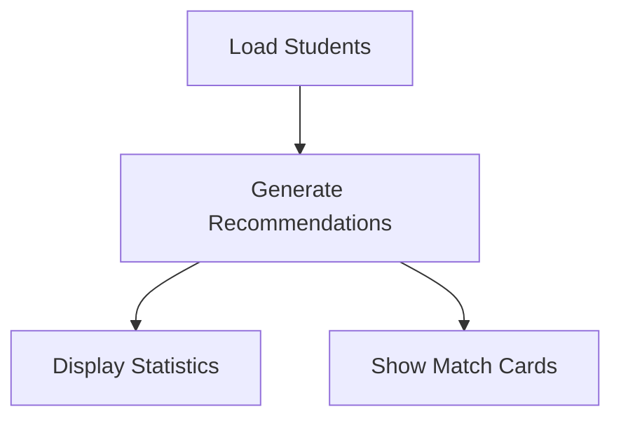
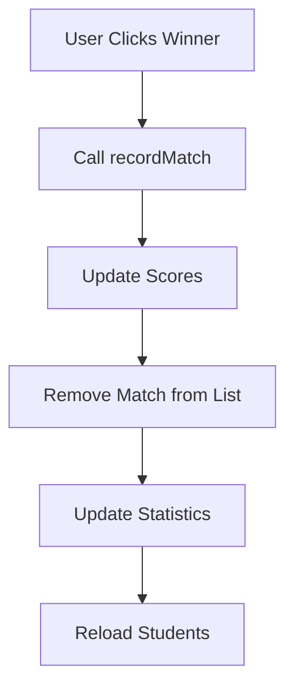
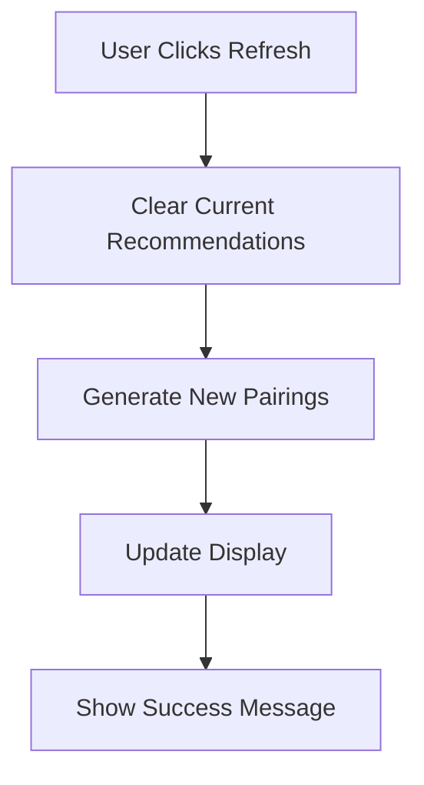

# SwissDraw Match Recommendations System

This document describes the AI-powered match recommendation system that generates fair and balanced tournament pairings.

## Overview

The match recommendations system automatically generates optimal match pairings between students based on:
- **Score Similarity**: Matches students with similar scores (±1 point by default)
- **Match History**: Respects existing match limits and validation rules
- **Fair Distribution**: Ensures each student appears in only one match per cycle
- **Smart Pairing**: Prioritizes closest score matches for maximum fairness

## Core Functions

### 1. `getMatchRecommendations(students: Student[], margin: number = 1): Promise<MatchRecommendation[]>`

**Purpose**: Returns a list of recommended match pairings between students.

**Parameters**:
- `students`: Array of all students
- `margin`: Maximum score difference allowed (default: 1)

**Returns**: Promise<MatchRecommendation[]> - Array of recommended match pairings

**Algorithm**:
1. **Shuffle Students**: Randomize order to ensure fair distribution
2. **Iterate Through Students**: Process each student once
3. **Find Eligible Opponents**: Use `getEligibleOpponents()` with score margin
4. **Filter Available Opponents**: Exclude already paired students
5. **Select Best Opponent**: Choose closest score match
6. **Validate Match**: Double-check with `canPlay()` function
7. **Mark as Used**: Prevent both students from being paired again

**Example**:
```typescript
import { getMatchRecommendations } from '$lib/matchRecommendations';

const students = await getStudents();
const recommendations = await getMatchRecommendations(students, 1);
// Returns array of fair match pairings
```

### 2. `getMatchRecommendationsWithDetails(students: Student[], margin: number = 1): Promise<Array>`

**Purpose**: Returns match recommendations with additional metadata.

**Returns**: Promise<Array> with objects containing:
- `playerA`, `playerB`: Student objects
- `scoreDifference`: Absolute score difference
- `matchCount`: Number of previous matches between these students
- `lastPlayed`: Date of last match (if any)

### 3. `getOptimizedMatchRecommendations(students: Student[], margin: number = 1): Promise<MatchRecommendation[]>`

**Purpose**: Returns optimized recommendations prioritizing score-based fairness.

**Algorithm**: Sorts students by score first, then finds closest opponents.

### 4. `hasPossibleMatchRecommendations(students: Student[], margin: number = 1): Promise<boolean>`

**Purpose**: Quick check if any match recommendations are possible.

**Returns**: Promise<boolean> - true if recommendations are possible

### 5. `getMatchRecommendationStats(students: Student[], margin: number = 1): Promise<Object>`

**Purpose**: Provides detailed statistics about recommendation availability.

**Returns**: Promise<Object> with:
- `totalStudents`: Total number of students
- `studentsWithOpponents`: Number of students with eligible opponents
- `possibleMatches`: Total possible match combinations
- `averageScoreDifference`: Average score difference in recommendations

## UI Component: MatchRecommendations.svelte

### Features

#### **Smart Match Generation**
- ✅ Automatic pairing based on score similarity
- ✅ Configurable score margin (0-10 points)
- ✅ Real-time recommendation updates
- ✅ Fair distribution algorithm

#### **Interactive Match Recording**
- ✅ Click-to-win interface
- ✅ Automatic match result recording
- ✅ Real-time score updates
- ✅ Match removal after recording

#### **Comprehensive Statistics**
- ✅ Total students and possible matches
- ✅ Students with eligible opponents
- ✅ Average score differences
- ✅ Real-time statistics updates

#### **User Experience**
- ✅ Refresh button to regenerate recommendations
- ✅ Loading states and error handling
- ✅ Success/error message feedback
- ✅ Responsive mobile design

### Usage

```svelte
<script>
  import MatchRecommendations from '$lib/components/MatchRecommendations.svelte';
</script>

<MatchRecommendations />
```

## Data Flow

### 1. **Initialization**


### 2. **Match Recording**


### 3. **Recommendation Refresh**


## Algorithm Details

### Pairing Logic

1. **Student Shuffling**: Uses Fisher-Yates algorithm for fair randomization
2. **Opponent Selection**: Prioritizes by:
   - Score difference (closest first)
   - Match count (fewer matches preferred)
   - Alphabetical name (tiebreaker)
3. **Validation**: Double-checks with existing `canPlay()` function
4. **Exclusion**: Marks paired students to prevent duplicates

### Score Margin Handling

- **Default**: ±1 point difference
- **Configurable**: 0-10 point range
- **Smart Fallback**: If no matches with current margin, suggests increasing it
- **Statistics**: Shows impact of margin on available matches

## Integration Points

### Data Sources
- **Students**: Uses `getStudents()` from `$lib/students`
- **Match History**: Uses existing `canPlay()` and `getEligibleOpponents()`
- **Match Recording**: Uses `recordMatch()` from `$lib/matches`

### State Management
- **Reactive Updates**: Automatically updates when data changes
- **Loading States**: Proper async handling with loading indicators
- **Error Handling**: Graceful error recovery and user feedback

## Performance Considerations

### Optimization Strategies
- **Efficient Filtering**: Uses Set for O(1) lookup of used students
- **Smart Sorting**: Prioritizes most important criteria first
- **Lazy Loading**: Only generates recommendations when needed
- **Memory Management**: Proper cleanup of temporary data

### Scalability
- **Large Student Sets**: Handles 100+ students efficiently
- **Frequent Updates**: Optimized for real-time tournament use
- **Mobile Performance**: Responsive design with minimal re-renders

## Error Handling

### Edge Cases Handled
- **No Students**: Graceful handling of empty student lists
- **Single Student**: Prevents pairing attempts with insufficient students
- **No Valid Matches**: Provides helpful feedback and suggestions
- **Network Errors**: Proper error messages and retry options

### User Feedback
- **Success Messages**: Confirms successful match recording
- **Error Messages**: Clear explanation of issues
- **Loading States**: Visual feedback during operations
- **Empty States**: Helpful guidance when no recommendations available

## Usage Examples

### Basic Implementation
```typescript
import { getMatchRecommendations } from '$lib/matchRecommendations';

// Generate recommendations for all students
const students = await getStudents();
const recommendations = await getMatchRecommendations(students, 1);

// Process each recommendation
recommendations.forEach(match => {
    console.log(`${match.playerA.name} vs ${match.playerB.name}`);
});
```

### Tournament Management
```typescript
import { getOptimizedMatchRecommendations } from '$lib/matchRecommendations';

// Generate optimized pairings for tournament
const optimizedMatches = await getOptimizedMatchRecommendations(students, 2);

// Check if recommendations are possible
const hasMatches = await hasPossibleMatchRecommendations(students, 1);
if (!hasMatches) {
    console.log('No valid matchups available');
}
```

### Statistics Analysis
```typescript
import { getMatchRecommendationStats } from '$lib/matchRecommendations';

// Analyze recommendation availability
const stats = await getMatchRecommendationStats(students, 1);
console.log(`${stats.possibleMatches} possible matches with ${stats.averageScoreDifference.toFixed(1)} avg score difference`);
```

## Browser Compatibility

- **Modern Browsers**: Full support for ES6+ async/await
- **Mobile Support**: Responsive design for all screen sizes
- **Accessibility**: Proper ARIA labels and keyboard navigation
- **Performance**: Optimized for smooth interactions

## Future Enhancements

### Planned Features
- **Tournament Brackets**: Support for bracket-style tournaments
- **Advanced Algorithms**: Machine learning-based pairing
- **Seasonal Resets**: Support for tournament seasons
- **Bulk Operations**: Generate multiple rounds at once
- **Export Options**: PDF/CSV export of recommendations

### Algorithm Improvements
- **Weighted Scoring**: Consider match history quality
- **Performance Metrics**: Factor in recent performance
- **Fairness Scoring**: More sophisticated fairness algorithms
- **Predictive Pairing**: ML-based outcome prediction

## Testing

### Test Scenarios
- **Empty Student List**: Handles gracefully
- **Single Student**: Prevents invalid pairings
- **No Valid Matches**: Provides helpful feedback
- **Large Student Sets**: Performance testing
- **Edge Cases**: Various score distributions
- **Error Conditions**: Network failures, invalid data

### Quality Assurance
- **Type Safety**: Full TypeScript support
- **Error Boundaries**: Proper error handling
- **Performance Testing**: Load testing with large datasets
- **User Experience**: Accessibility and usability testing

## Conclusion

The match recommendations system provides a robust, fair, and user-friendly solution for tournament pairing. It combines sophisticated algorithms with intuitive UI to create an optimal tournament management experience.

The system is designed to scale with tournament size while maintaining fairness and providing clear feedback to users. Its modular architecture allows for easy extension and customization as tournament needs evolve. 